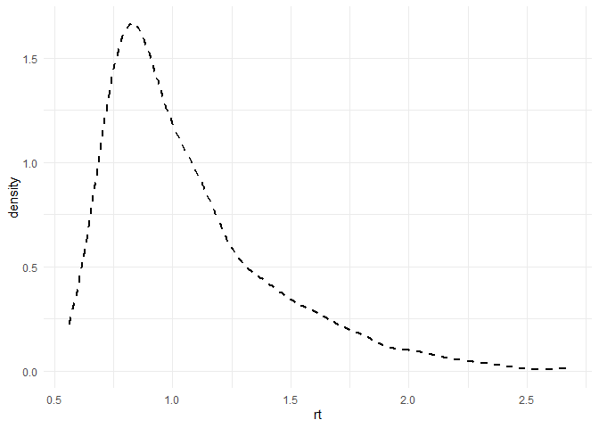
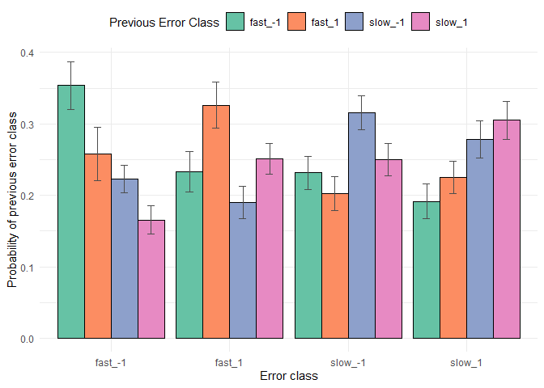
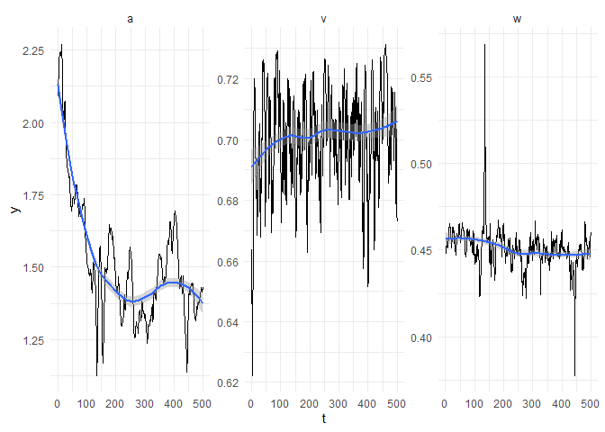

# Autoregressive DDM
Sven Wientjes

In this document, we will discuss, fit, and evaluate a Drift Diffusion
Model (DDM) with auto-regressive (AR1) processes for it’s main
parameters, using the software [Stan](https://mc-stan.org/cmdstanr/),
and demonstrate how this model can converge in **60 to 90 seconds** for
a typical participant without any sophisticated parallel computing. This
is much faster than the typical variability-incorporating 6 (or 7)
parameter DDM will converge with Stan, which took me about 4500 seconds
(~1 hour 15 minutes) without parallel computing to draw the same number
of samples[^1].

This tutorial is directly inspired by the great work of [Vloeberghs et
al. (2026)](https://www.biorxiv.org/content/10.64898/2026.03.20.713186v1.abstract),
who first developed this AR(1) variant of the DDM, identified a unique
signature of it in terms of *temporally clustered errors*, and provided
an Amortized Bayesian Inference (ABI) network to estimate the parameters
based on empirical data.

The major advantage of ABI is that after an expensive training phase,
inference for different participants or datasets becomes nearly
instantaneous, giving it good scaling to large datasets. Nevertheless,
by implementing the model in Stan, we can get a couple of distinct
advantages compared to an ABI implementation, albeit at the cost of
slightly longer inference times:

1.  Amortized inference is not exact. Even though the parameter recovery
    *can* be highly accurate, no mathematical *guarantee* exists that we
    are sampling from the true posterior distribution. With Stan this
    guarantee exists in theory, and Stan offers excellent diagnostics
    (i.e., $\hat{R}$ and $ESS$) to help establish this in practice.

2.  Amortized inference fixes the prior distribution and number of
    trials that can be handled. Implementation in Stan allows variable
    trial numbers per participant, and allows for easy changes of the
    prior distribution.

3.  The implementation we will consider has a principled way of dealing
    with missing data. Missing data is common in choice-RT experiments,
    because often fast and slow outliers are excluded. These data are
    assumed not to arise from hypothesized evidence accumulation
    dynamics, but from contaminating processes.

This tutorial is interactive. You can clone or download this repository
and open the `MovingDDM.Rproj` to run code yourself.

## The AR1-DDM model

The DDM is a generative model of binary responses and related response
times. It assumes that within a trial, evidence accumulates with an
average rate of $\delta$ (the *drift rate*) until an upper or lower
boundary is reached. These boundaries are separated by a parameter $a$.
The evidence accumulation process does not have to start in the middle
between the upper and lower boundary–it can start closer to either
boundary, relatively parameterized as $\beta \in [0,1]$. The observed
response times also incorporate non-decision time $\tau$, on top of the
time it takes to complete the evidence accumulation process. Under this
standard formulation of the DDM, the probability of hitting the upper
boundary at time $y$ can be computed with the [Wiener first passtime
distribution](https://mc-stan.org/docs/functions-reference/positive_lower-bounded_distributions.html#wiener-first-passage-time-distribution):

$p(y|\delta, \alpha, \beta, \tau) = \frac{\alpha3}{(y-\tau)^{3/2}} e^{-\delta \alpha \beta - \frac{\delta^2(y-\tau)}{2}}\sum_{k=-\infty}^\infty (2k+\beta)\phi(\frac{2k\alpha+\beta}{\sqrt{y-\tau}})$

To turn this 4-parameter variant of the DDM into an AR(1) variant, we
will make the drift rate $\delta$, starting point $\beta$, and boundary
separation $\alpha$ fluctuate over trials $t$. These parameters now
consist of a fixed component and a fluctuating component:

$\delta_t = \delta + \gamma_t$

$\beta_t = \beta + \zeta_t$

$\alpha_t = \alpha + \xi_t$

These fluctuating components $\gamma_t$, $\zeta_t$, and $\xi_t$,
fluctuate according to an AR(1) process:

$\gamma_t = \rho_\gamma \gamma_{t-1} + \epsilon_{\gamma, t}$ with
$\epsilon_{\gamma, t} \sim \mathcal{N}(0,\sigma_\gamma^2)$

$\zeta_t = \rho_\zeta \zeta_{t-1} + \epsilon_{\zeta, t}$ with
$\epsilon_{\zeta, t} \sim \mathcal{N}(0,\sigma_\zeta^2)$

$\xi_t = \rho_\xi \xi_{t-1} + \epsilon_{\xi, t}$ with
$\epsilon_{\xi, t} \sim \mathcal{N}(0,\sigma_\xi^2)$

with $\rho$ being the *autoregressive coefficient* determining the
correlation over time, and $\sigma$ being the *innovation variance*
determining the scale of the fluctuations over time. Note that this
formulation implies parameters $\epsilon$ that are different for each
trial $t$. What makes fitting the AR(1) process tricky, is that if we
have a dataset with 100 trials in it, and three parameters that
fluctuate over trials, we will need 300 parameters to capture these
fluctuations! This sounds daunting, but is actually a case that Stan can
handle very well, as we will see.

## Exploring the data

Lets set up the packages and functions we will use in this tutorial
first:

``` r
library(cmdstanr)
library(data.table)
library(ggplot2)
library(RWiener)
source("functions/CAF.R")
source("functions/correlated_errors.R")
```

Like Vloeberghs et al., we will use the data of Experiment 2B from
[Desender et al. (2022)](https://doi.org/10.1038/s41467-022-31727-0).
Let’s load it and do some simple data wrangling:

``` r
# Load data
MyData <- fread("https://raw.githubusercontent.com/kdesende/dynamic_influences_on_static_measures/refs/heads/main/data_exp2B.csv")

# Get nicer participant numbers
MyData$pp         <- ordered(MyData$sub)
levels(MyData$pp) <- c(1:99)

# Recode stimulus 0 to -1
MyData[stim==0,stim:=-1]

# Mark trials for exclusion
MyData$yi <- 1
MyData[rt<0.1|rt>3.0,yi:=0]
```

Note that we use `$yi` to mark fast and slow outliers with a 0, while
all other trials are marked with a 1. This is how we will deal with data
exclusion, without breaking the temporal structure of the data.

### Visualizing RT distributions

We can visualize the (marginal) RT distribution of a specific
participant:

``` r
ggplot(MyData[pp==69 & yi==1], aes(x=rt)) +
  geom_density(linetype="dashed",linewidth=1) +
  theme_minimal()
```



### Visualizing the Conditional Accuracy Function (CAF)

The Conditional Accuracy Function (CAF) partitions this response time
distribution into different regions with equal numbers of trials in
them. It then visualizes the proportion of correct trials in each bin
against the mean RT of the trials in that bin. This reveals
substantially more errors for very fast responses, as well as
substantially more errors for very slow responses. The typical DDM with
4 parameters can not explain these fast and slow errors–it predicts a
relatively uniform relationship between choice and accuracy.

``` r
# Get CAF and confidence interval
CAF <- calculate_group_caf(MyData[yi==1], "rt", "cor", "pp", num_bins=7)
CAF[,min_acc:=mean_acc-1.96*se_acc]
CAF[,max_acc:=mean_acc+1.96*se_acc]

## Group conditional accuracy function
ggplot(CAF, aes(x=mean_rt, y=mean_acc)) +
  geom_point() +
  geom_errorbar(aes(ymin=min_acc,ymax=max_acc),width=0.05) +
  geom_line() +
  theme_minimal() +
  xlab("RT") + ylab("Accuracy")
```


### Visualizing correlated errors

Now for the signature of the autocorrelated DDM, we can assign each
trial into the 50% fastest or 50% slowest errors. We can then visualize
for each error class, what was the probability of the preceding error
classes. This reveals that errors are likely to repeat both in identity
(i.e., an error by responding with `-1` is more likely to be followed by
another error responding with `-1`) as well as by speed (i.e., slow
errors tend to occur successively, and fast errors tend to occur
successively). A typical 4-parameter DDM treats each trial as
independent and identically distributed. This means that preceding
errors bear no relation to successive error responses by design.

``` r
group_stats <- get_error_cor(MyData)
ggplot(group_stats, aes(x = er_class, y = mean_prob, fill = prev_er_class)) +
  geom_bar(
    stat     = "identity", 
    position = position_dodge(width = 0.9), 
    color    = "black", 
    lwd = 0.3
  ) +
  geom_errorbar(
    aes(ymin     = ci_lower, ymax = ci_upper),
    position = position_dodge(width = 0.9),
    width    = 0.25, # Width of the error bar caps
    color    = "grey30"
  ) +
  scale_fill_brewer(palette = "Set2", name = "Previous Error Class") +
  theme_minimal() +
  xlab("Error class") + ylab("Probability of previous error class") +
  theme(legend.position="top")
```



## Fitting the model

Now let’s fit the autocorrelated DDM to the empirical data using Stan.
The model code is contained in `models/DDM_AR1.stan`. To make this model
run fast and stable, we can reparameterize the local fluctuations as
follows:

Remember that an autoregressive process evolves according to the
equation

$X_t = \rho X_{t-1} + \epsilon_{t}$ with
$\epsilon_{\gamma, t} \sim  \mathcal{N}(0, \sigma^2)$

but this formulation yields a total stationary variance of
$Var(X) = \frac{\sigma^2}{1-\rho^2}$. This means that the variance
changes interactively whenever $\rho$ or $\sigma$ change. Stan does not
like these kind of dependencies, but luckily we can separate them.

We can fix the variance of the latent state $X_t$ over time to be
exactly 1. We can do this by drawing standard normal innovations
$Z_t \sim \mathcal{N}(0,1)$ and scaling them by $\sqrt{1-\rho^2}$ :

$X_t = \rho X_{t-1} + \sqrt{1-\rho^2} Z_t$

We can then make whatever parameter we want dependent on this
standardized latent state, and only later introduce parameter $\sigma$
to scale this latent state. For example, for the drift rates:

$\delta_t = \delta + \sigma_\gamma^2 \gamma_{t}$

where now the fluctuations of drift rate $\gamma_t$ are implemented the
same way we described the dynamics above for $X_t$. This
reparameterization separates the influence of correlation $\rho$ and
scale $\sigma$, allowing for **much** faster and more stable sampling in
Stan.

### Actually fitting the model

The code below is what I used to fit the model. Unfortunately, I
couldn’t host the files with the samples on GitHub, as they are too
large. To continue with the tutorial, you can either run this fit
yourself, or download a .rar file with my fits here. Unpack these into
`fits/AR1` to continue.

``` r
# Load the Stan model
DDMmod <- cmdstan_model("models/DDM_AR1.stan")

# Loop over paraticipants to fit
for(PNUM in 1:99){
  Pdat <- MyData[pp==PNUM]
  
  DataList <- list(N       = nrow(Pdat),
                   choice  = Pdat$response,
                   stim    = Pdat$stim,
                   y       = Pdat$rt,
                   yi      = Pdat$yi,
                   min_rt  = min(Pdat[yi==1]$rt))
  
  # Fit the model
  fit <- DDMmod$sample(
    data            = DataList,
    chains          = 4,
    parallel_chains = 4,
    adapt_delta     = 0.80,
    max_treedepth   = 10,
    init_buffer     = 200,
    term_buffer     = 200,
    window          = 25,
    iter_warmup     = 1975,
    iter_sampling   = 2000,
    output_dir      = "fits/AR1",
    output_basename = paste0("AR1_pp",formatC(PNUM,width=2,flag="0"))
  )
}
```

We can also evaluate the success of these fits, by checking for every
parameter whether $\hat{R} < 1.01$, and whether $ESS_{bulk} > 1000$ and
$ESS_{tail} > 1000$. Below I print results for participant 1 and
participant 99. You can change this to evaluate every participant, but
beware of long run times:

``` r
PNUM <- c(1,99) # make 1:99 to evaluate all
for(p in PNUM){
  DDMfit <- as_cmdstan_fit(paste0("fits/AR1/AR1_pp",formatC(p,width=2,flag="0"),"-",1:4,".csv"))
  TheSum <- DDMfit$summary()
  print(paste0("---- PP",formatC(p,width=2,flag="0")," ----"))
  print("BAD RHAT:")
  print(which(TheSum$rhat > 1.01))
  print("BAD ESS BULK:")
  print(which(TheSum$ess_bulk < 1000))
  print("BAD ESS TAIL:")
  print(which(TheSum$ess_tail < 1000))
}
```

    [1] "---- PP01 ----"
    [1] "BAD RHAT:"
    integer(0)
    [1] "BAD ESS BULK:"
    integer(0)
    [1] "BAD ESS TAIL:"
    integer(0)
    [1] "---- PP99 ----"
    [1] "BAD RHAT:"
    integer(0)
    [1] "BAD ESS BULK:"
    integer(0)
    [1] "BAD ESS TAIL:"
    integer(0)

``` r
# Remove large objects for caching
rm(DDMfit,TheSum);gc(verbose=FALSE)
```

              used (Mb) gc trigger   (Mb)  max used   (Mb)
    Ncells 1208493 64.6    2372617  126.8   2372617  126.8
    Vcells 2572864 19.7  175798296 1341.3 187949400 1434.0

The returned `integer(0)` means that no parameters had bad $\hat{R}$ or
$ESS$. Note that this checks not only the global parameters $\delta$,
$\beta$, $\alpha$, and $\tau$, but also for each trial the local
fluctuations $\gamma_t$, $\zeta_t$, $\xi_t$.

## Exploring the fit

Let’s first get an intuition for what the AR(1) process does to our
parameters. In the notation of our Stan model, we have drift rate `v`,
bias `w`, and boundary separation `a` that vary over time. We can plot
the posterior means of these parameters for each of the 500 trials for a
single participant. We can also overlay a smooth loess fit, to inspect
any structural changes in parameters that may not be obvious from the
trial-by-trial noise:

``` r
# Select & load participant fit
PNUM <- 1
DDMfit <- as_cmdstan_fit(paste0("fits/AR1/AR1_pp",formatC(PNUM,width=2,flag="0"),"-",1:4,".csv"))

# Extract parameters and compute posterior means
v_draws  <- apply(DDMfit$draws("v",format="matrix"),2,mean)
w_draws  <- apply(DDMfit$draws("w",format="matrix"),2,mean)
a_draws  <- apply(DDMfit$draws("a",format="matrix"),2,mean)

# Combine into a single data.table for plotting
plot_draws <- data.table(t = rep(1:500,3),
                         p = rep(c("v","w","a"),each=500),
                         y = c(v_draws,w_draws,a_draws))

# Plot
ggplot(plot_draws, aes(x=t,y=y)) +
  facet_wrap(.~p,scales="free") +
  geom_line() +
  geom_smooth() +
  theme_minimal()
```



``` r
# Remove large objects for caching
rm(DDMfit,v_draws,w_draws,a_draws,plot_draws);gc(verbose=FALSE)
```

              used  (Mb) gc trigger  (Mb)  max used   (Mb)
    Ncells 2334520 124.7    4435780 236.9   4435780  236.9
    Vcells 4559062  34.8   90008728 686.8 187949400 1434.0

We can see strong structural changes over time in the boundary
separation `a` for this participant, and weaker but notable increases in
drift rate `v`. We also see a slight drift in response bias `w` with
some distinct moments of spiking.

### Simulating data for posterior predictive checking

We will simulate data from the posterior for each participant, trimming
the posterior distribution down to 500 samples (from the original 8000).

### PPC of the CAF

Bla.

### PPC of clustered errors

Bla.

## Conclusion

It appears that parameterizing the DDM with local fluctuations according
to an AR(1) process is much more effective in Stan, compared to relying
on between-trial variability variants of the DDM likelihood itself. Not
only do we get faster fits this way, we can also capture local patterns
in errors as argued by Vloeberghs et al. Extensions of this work should
focus on recoverability of the latent trajectories, and developing
hierarchical Bayesian implementations of this model that partially pool
global parameters $\delta$, $\beta$, $\alpha$, $\tau$, $\rho$ and
$\sigma$ across participants in the same experiment.

[^1]: Results obtained using an AMD Ryzen 7 7700 CPU.
